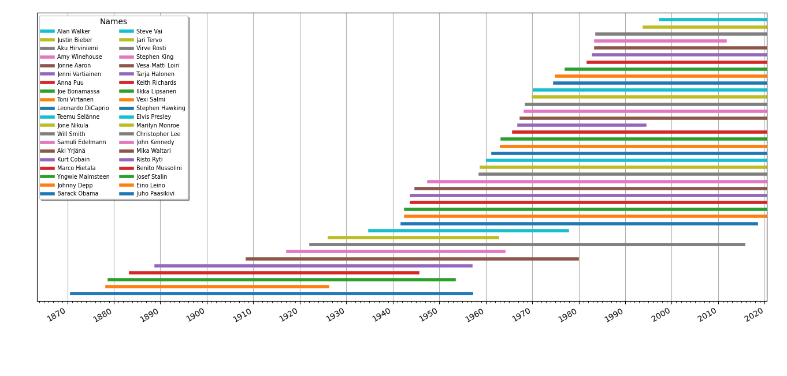

# Timeline

## Overview

Application for visualising peoples lifespans with _matplotlib_. Currently uses wikipedia as main data source.

## How to use

1. Make sure you've initiated sqlite database with __/data/init.sql__ to the same folder
	* `cd data/`
	* `sqlite3 wiki.db`
	* `.read init.sql`
	* `.exit` or Ctrl-D
2. Run `python3 timeline.py`
3. Begin by inserting names on the command line

Wikipedias HTML structure can vary between pages which can result in an exception.

When you want to visualize the data on the command line run 'p' and it will prompt you a number. It acts as a limit value for random sampling. Option 'a' will print the entire database orderer by total age ascending.

## TBI

* Manual input
* Automatic database initiation
* Wiki scraper for automated database expansion
* Other sources
* Exception handling

---

## Images

---

## Technical aspects

timeline.py contains all main functions. _requests_ library is used to fetch html pages from sources. _BeautifulSoup_ parses dates from wikipedias "infobox" element. The results and persons name are stored in a sqlite database.

Plotting is done based on sql quaries. Lines representing a lifespan are generated from a persons name and two _datetime_ objects. 
